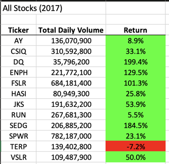
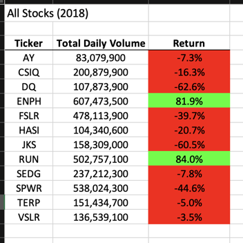
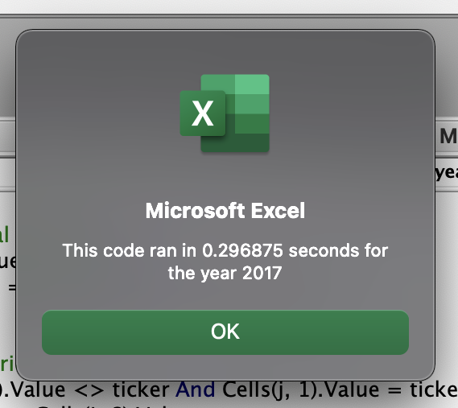
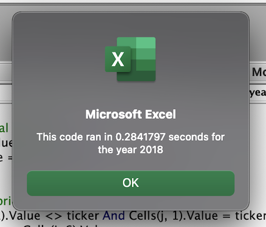
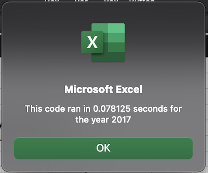
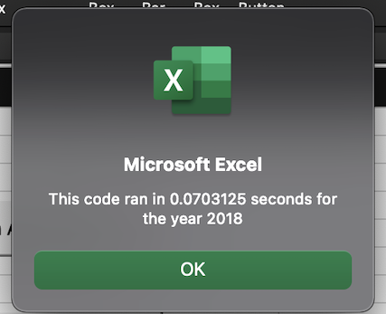

# stock-analysis

## Overview of Project

The purpose of this project was to create a VBA script to parse annual stock market data for a given set of tickers. When run, the script prompts the user to input a year and then generates a table which contains the ticker, total daily volume, and annual return for each stock represented in the dataset.

Having successfully created a VBA script, which performs as detailed above, further work was done to refactor the original script. The purpose of refactoring the working script was to improve performance in anticipation of the script being used to analyze a far greater set of stocks in the future.

## Results

### Stock Performance

2017 results

- 2017 was overall a very good year. Every stock, with the exception of TERP (-7.2%), saw their share prices increase. DQ and SEDG performed particularly well posting gains of 199.4% and 184.5% respectively.

2018 results

- 2018 by comparison was an overall poor year for this basket of stocks. With the exception of ENPH (+81.9) and RUN (+84.0%), all the stocks posted negative annual returns. It was a particularly bad year for DQ and JKS, which had annual returns of -62.6% and -60.5% respectively.

### Execution Times

The execution time results below highlight the superior execution time achieved by refactoring the AllStockAnalysis code.

Original script execution times:

- 2017 Analysis: the original code ran in .296875 seconds

- 2018 Analysis: the original code ran in .2841797 seconds

Refactored script execution times:

- 2017 Analysis: the refactored code ran in .078125 seconds

- 2018 Analysis: the refactored code ran in .0703125 seconds

## Summary: In a summary statement, address the following questions

What are the advantages or disadvantages of refactoring code?

- There is a detailed statement on the advantages and disadvantages of refactoring code in general (3 pt).

How do these pros and cons apply to refactoring the original VBA script?

- There is a detailed statement on the advantages and disadvantages of the original and refactored VBA script (3 pt).

### Advantages

The primary advantage to refactoring the original VBA script is the reduction in execution time. As detailed above, the time needed for script to run for each year is drastically lower. For 2017 the execution time was reduced by 73.7%, and for 2018 the execution time was reduced by 75.3%.

- Disadvantages:
