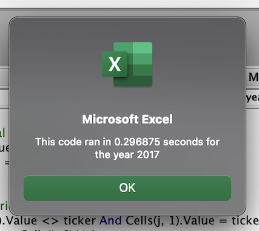

# stock-analysis

## Overview of Project: Explain the purpose of this analysis

## Results: Using images and examples of your code, compare the stock performance between 2017 and 2018, as well as the execution times of the original script and the refactored script

### Stock Performance

2017 reusults

- 2017 reults text
- 2017 results image

2018 results

- 2018 reults text
- 2018 results image

results summation

### Exection Times

The execution time results below highlight the superior execution time achieved by refactoring the AllStockAnalysis code.

Original script execution times:

- 2017 Analysis: the code ran in .296875 seconds (75% test)

- 2018 Analysis: the code ran in .2841797 seconds

Refactored script execution times:

- 2017 Analysis: the code ran in .xxxxxx seconds

- 2018 Analysis: the code ran in .xxxxxx seconds

## Summary: In a summary statement, address the following questions

What are the advantages or disadvantages of refactoring code?

- There is a detailed statement on the advantages and disadvantages of refactoring code in general (3 pt).

How do these pros and cons apply to refactoring the original VBA script?

- There is a detailed statement on the advantages and disadvantages of the original and refactored VBA script (3 pt).
